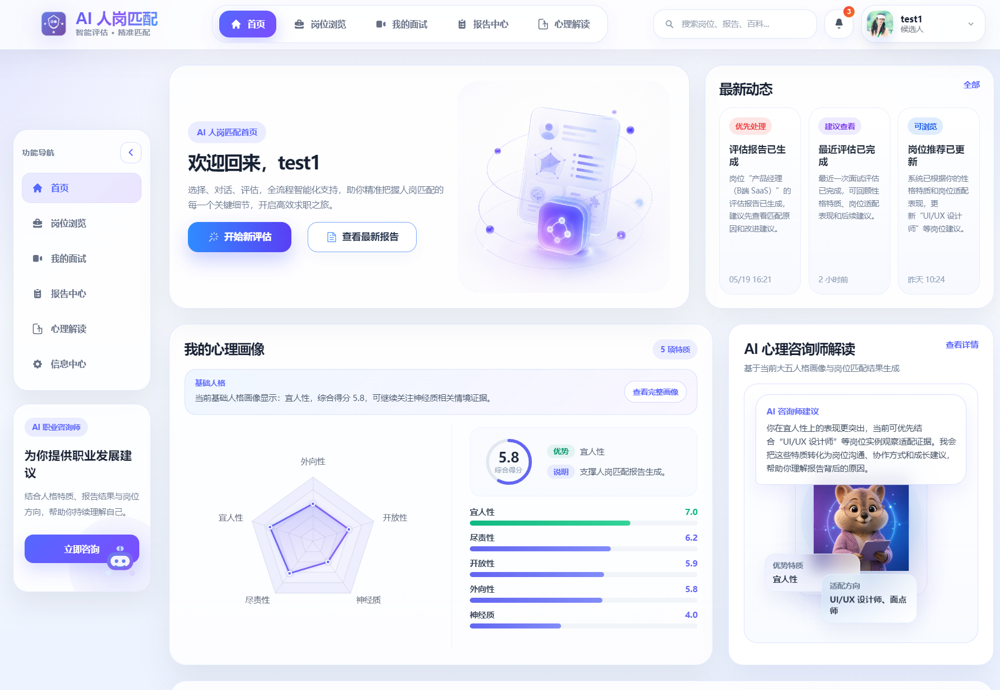
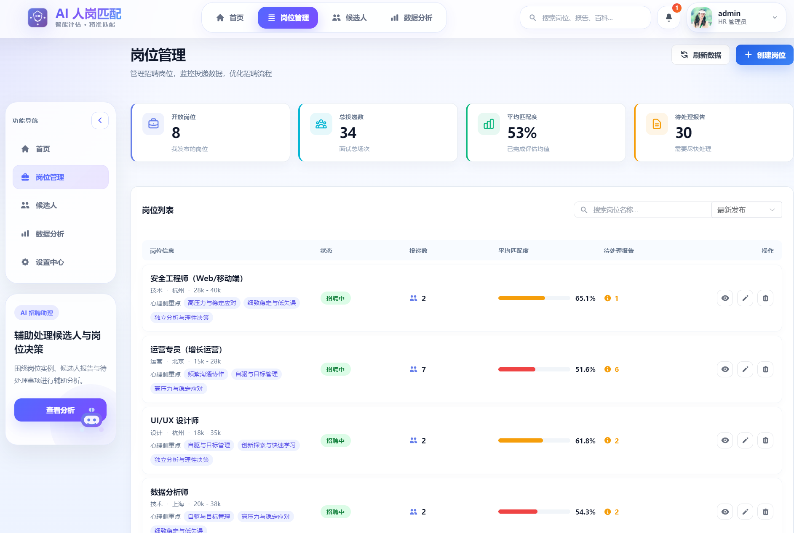
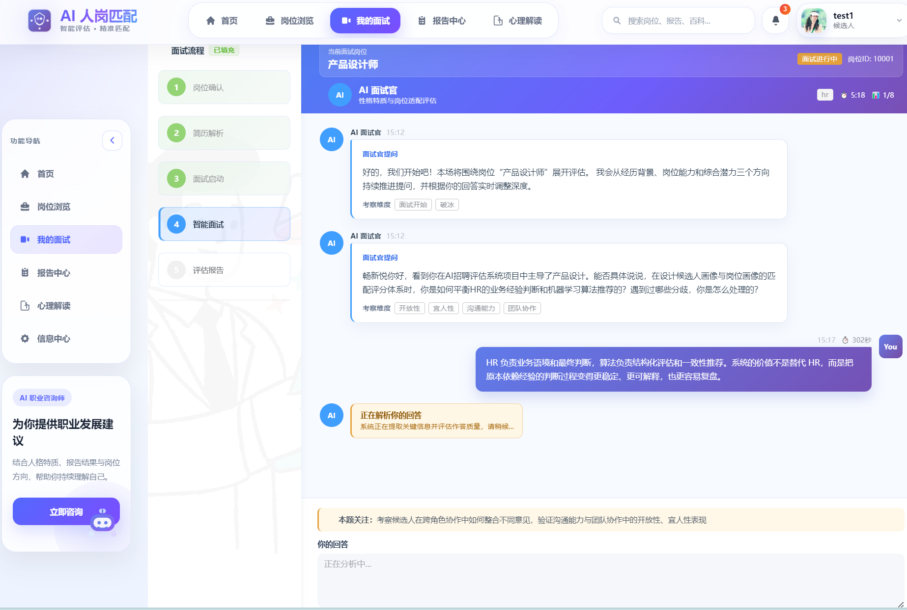
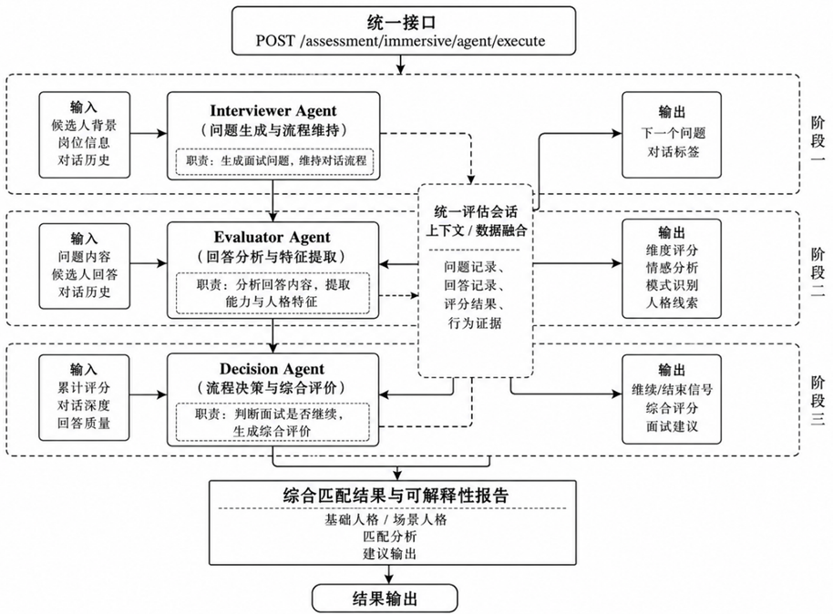
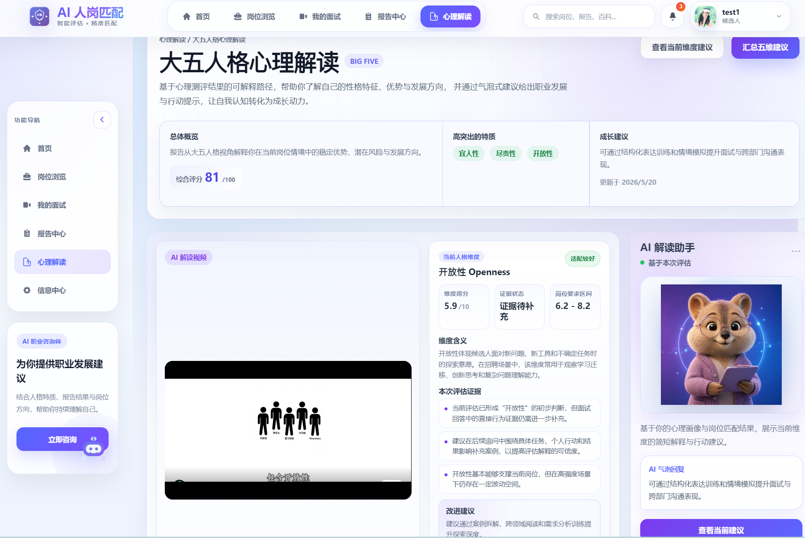
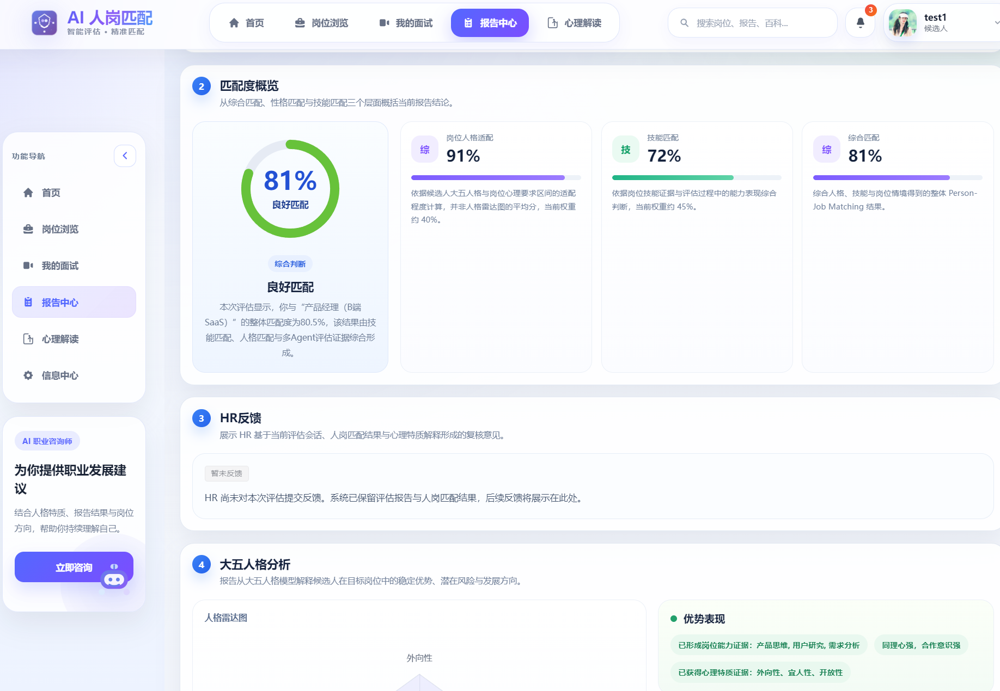
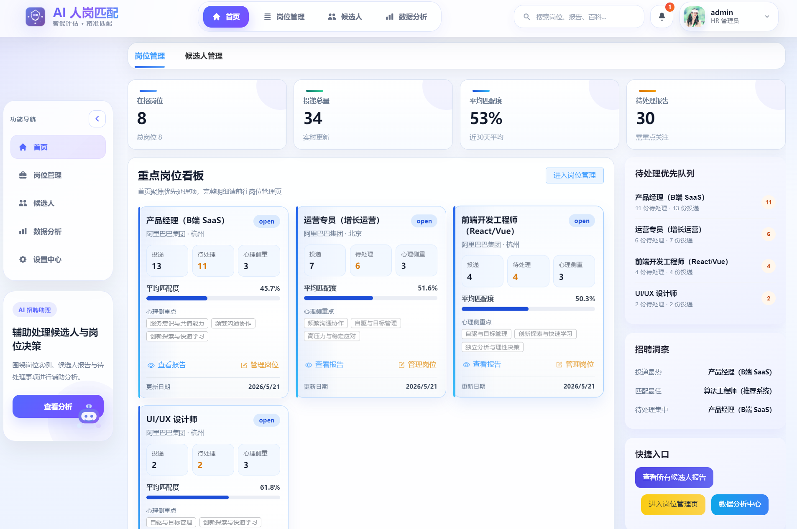
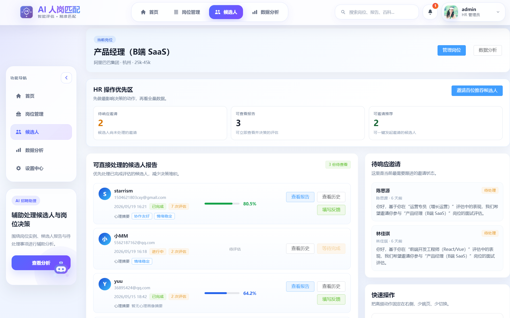
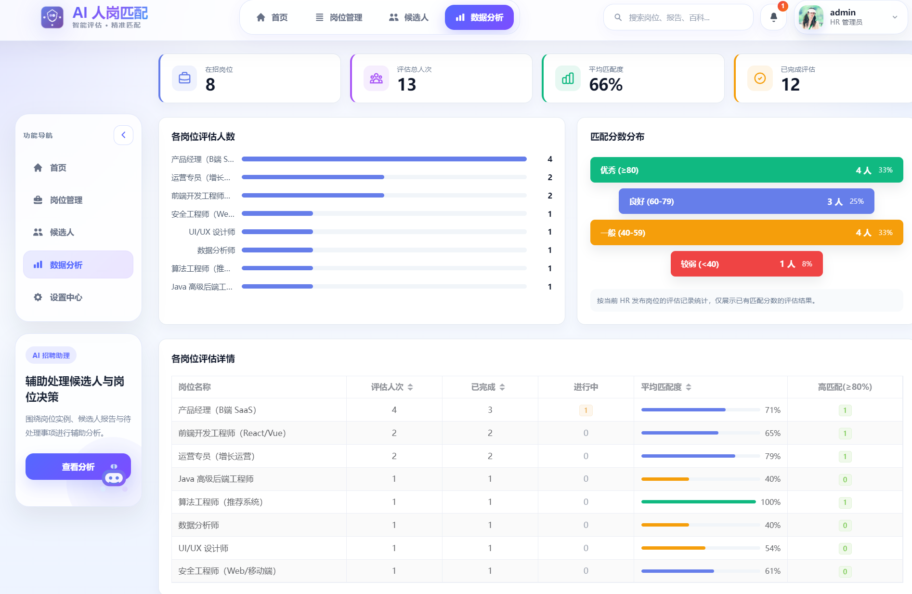

# 基于AI智能体的人岗匹配心理特质评估系统

## 1. 项目定位

本项目是一个面向招聘评估场景的智能评估平台，围绕“岗位要求如何结构化”“候选人心理特质如何评估”“评估结果如何解释”三个问题展开。系统通过多智能体协同面试获取候选人的回答证据，结合大五人格模型形成人格评分，再与岗位要求进行匹配分析，最终生成可解释的人岗匹配报告。

系统包含岗位建模、评估会话、智能面试、人格评分、匹配计算和报告展示的完整流程。



## 2. 技术栈

前端采用 Vue 3、TypeScript 和 Element Plus，主要负责页面呈现、用户交互、流程引导和评估结果可视化。

后端采用 FastAPI、Python、SQLAlchemy 和 MySQL，主要负责业务流程控制、评估会话管理、人格评分、人岗匹配计算和报告数据生成。

系统采用前后端分离结构，前端不直接承担人格计算和匹配计算，核心评估逻辑集中在后端服务层中维护。

## 3. 核心设计思路

### 3.1 岗位建模：区分岗位模板与岗位实例

系统将岗位建模拆分为“岗位模板”和“岗位实例”两个层次。岗位模板用于描述某一类岗位相对稳定的能力要求和人格特质要求；岗位实例则对应一次具体招聘任务，包含公司、岗位描述、招聘要求、候选人关联和评估结果。

这样的设计可以避免把所有岗位都当作一次性文本处理，也便于后续复用同类岗位的评估标准。




### 3.2 评估会话：保证每次评估独立

每一次候选人评估都需要通过评估会话组织。评估会话负责关联候选人、岗位实例、面试记录、人格评分和评估报告，是系统保证数据隔离和流程一致性的关键对象。

通过评估会话，系统可以避免不同候选人、不同岗位或不同面试轮次的数据混淆。后续的多轮对话、智能体分析、人格评分和匹配结果都围绕同一个会话流转。




### 3.3 多智能体面试：将面试职责拆开

面试过程采用多智能体协同方式完成，主要包括面试智能体、评价智能体和决策智能体。面试智能体负责生成问题并维持对话节奏；评价智能体负责分析候选人回答并提取人格表现；决策智能体负责判断是否继续追问、是否结束面试以及如何形成综合结论。

这种拆分使面试流程更容易维护，也更符合“问题生成、回答分析、流程决策”三类任务的不同特点。




### 3.4 人格解读：基于大五人格

系统以大五人格模型作为心理特质评估基础。基础人格用于描述候选人相对稳定的人格倾向，场景人格用于描述候选人在特定岗位情境中的行为表现。

二者的区分可以让报告既有总体人格画像，也能体现候选人在具体岗位要求下的适配情况，从而服务于后续的人岗匹配分析。这是基于大五人格的心理画像解读




### 3.5 匹配报告：强调可解释性链路

系统最终生成的评估报告不只展示一个总分，还包括人格维度得分、岗位匹配拆解、证据说明和改进建议。报告的目标是让人力资源人员和候选人理解“为什么匹配”或“为什么不完全匹配”。




可解释性链路可以概括为：

```text
岗位要求
  ↓
评估会话
  ↓
多智能体面试
  ↓
人格评分
  ↓
人岗匹配计算
  ↓
可解释性评估报告
```

## 4. 核心功能模块

### 4.1 候选人端

候选人端主要完成岗位浏览、岗位详情查看、面试参与、人格画像查看和评估报告查看。候选人可以从岗位页面进入评估流程，也可以在“我的面试”中继续已创建的评估会话。


主要页面包括：

- `frontend/src/views/HomePage.vue`：候选人首页与心理画像入口。
- `frontend/src/views/JobListView.vue`：岗位浏览与筛选。
- `frontend/src/views/JobDetailView.vue`：岗位详情与岗位特质要求展示。
- `frontend/src/views/assessment/MyInterviewsPage.vue`：我的面试与评估记录。
- `frontend/src/views/assessment/ImmersiveRoleDialogue.vue`：沉浸式智能面试。
- `frontend/src/views/assessment/ReportPage.vue`：评估报告详情。

### 4.2 人力资源端

人力资源端主要完成岗位管理、候选人管理、邀请评估和数据分析。系统支持人力资源人员查看岗位下的候选人评估状态，并进入报告页面查看匹配结果。



截图说明：人力资源端首页展示岗位管理、候选人概览和评估入口，体现系统支持招聘管理侧的业务闭环。



截图说明：候选人管理页面用于展示不同岗位下候选人的评估状态、匹配结果和报告入口，便于人力资源人员进行筛选与跟进。



截图说明：数据分析页面用于从岗位、候选人和评估结果角度呈现统计信息，体现系统对招聘评估过程的汇总分析能力。

主要页面包括：

- `frontend/src/views/HRHomeView.vue`：人力资源端首页。
- `frontend/src/views/position/JobManageView.vue`：岗位管理。
- `frontend/src/views/hr/CandidateManageView.vue`：候选人管理。
- `frontend/src/views/hr/AnalyticsView.vue`：招聘评估数据分析。

### 4.3 后端服务

后端按照路由、服务、模型和数据结构分层组织。接口层尽量保持轻量，核心业务逻辑放在服务层，数据库模型与论文中的业务实体保持对应。

主要实现位置包括：

- `backend/routers/assessment.py`：评估相关接口。
- `backend/routers/job.py`：岗位相关接口。
- `backend/routers/hr_invitation.py`：邀请评估相关接口。
- `backend/services/immersive_dialogue.py`：沉浸式面试流程服务。
- `backend/services/personality_scoring.py`：人格评分服务。
- `backend/services/report_agent.py`：报告生成相关服务。
- `backend/services/agents/`：面试智能体、评价智能体和决策智能体。
- `backend/models/assessment.py`：评估相关数据模型。
- `backend/models/job.py`、`backend/models/job_requirement.py`：岗位与岗位要求模型。

## 5. 面试官快速阅读建议

如果只想快速了解项目设计，建议按以下顺序阅读：

1. 先读本文档，了解系统目标、核心链路和模块划分。
2. 再看 [current/SYSTEM_FUNCTIONAL_ARCHITECTURE.md](current/SYSTEM_FUNCTIONAL_ARCHITECTURE.md)，了解完整业务流程和系统架构。
3. 如果关注后端设计，看 [current/BACKEND_DESIGN_SUMMARY.md](current/BACKEND_DESIGN_SUMMARY.md) 和 [current/BACKEND_API_SPECIFICATION.md](current/BACKEND_API_SPECIFICATION.md)。
4. 如果关注前后端如何联动，看 [current/FRONTEND_BACKEND_INTEGRATION.md](current/FRONTEND_BACKEND_INTEGRATION.md)。
5. 如果关注论文表达和系统设计论述，看 [thesis](thesis) 目录中的章节草稿。

## 6. 当前文档入口

[current](current) 目录保留当前仍建议查阅的项目文档，包括系统概览、架构设计、接口说明、算法说明、环境配置、启动测试与关键模块说明。

建议优先阅读：

- [current/START_HERE.md](current/START_HERE.md)
- [current/PROJECT_SUMMARY.md](current/PROJECT_SUMMARY.md)
- [current/SYSTEM_FUNCTIONAL_ARCHITECTURE.md](current/SYSTEM_FUNCTIONAL_ARCHITECTURE.md)
- [current/SYSTEM_IMPLEMENTATION_DESCRIPTION.md](current/SYSTEM_IMPLEMENTATION_DESCRIPTION.md)
- [current/BACKEND_API_SPECIFICATION.md](current/BACKEND_API_SPECIFICATION.md)
- [current/FRONTEND_BACKEND_INTEGRATION.md](current/FRONTEND_BACKEND_INTEGRATION.md)
- [current/TEST_AND_VALIDATION_GUIDE.md](current/TEST_AND_VALIDATION_GUIDE.md)

## 7. 论文材料与历史归档

[thesis](thesis) 目录保留本科毕业论文相关材料，包括章节草稿、整合稿、模块化改写稿与测试计划。该目录中的文档应保持本科工科论文风格，适合用于论文撰写和答辩准备。

[archive](archive) 目录用于保存项目迭代过程中产生的阶段性文档。这些文件不建议作为当前实现依据，但可用于追溯历史问题、修复过程和阶段交付记录。

归档目录说明：

- [archive/api-routes](archive/api-routes)：接口路由清单、核验与更新记录。
- [archive/backend](archive/backend)：后端、数据库与迁移相关历史记录。
- [archive/frontend](archive/frontend)：前端页面、集成、白屏调试与交互调整记录。
- [archive/jobs-and-hr](archive/jobs-and-hr)：候选人、人力资源端、职位与投递流程相关迭代记录。
- [archive/resume-ocr](archive/resume-ocr)：简历解析、OCR 与 PaddleOCR 相关记录。
- [archive/fixes](archive/fixes)：错误诊断、快速修复和问题排查记录。
- [archive/reports](archive/reports)：阶段总结、完成报告、验证报告和交付报告。
- [archive/quick-guides](archive/quick-guides)：临时快速启动、快速参考和短期操作指南。
- [archive/implementation-notes](archive/implementation-notes)：其他实现说明、检查清单和后续计划。
