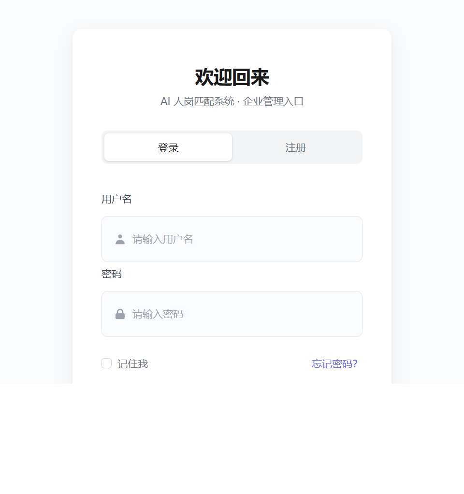
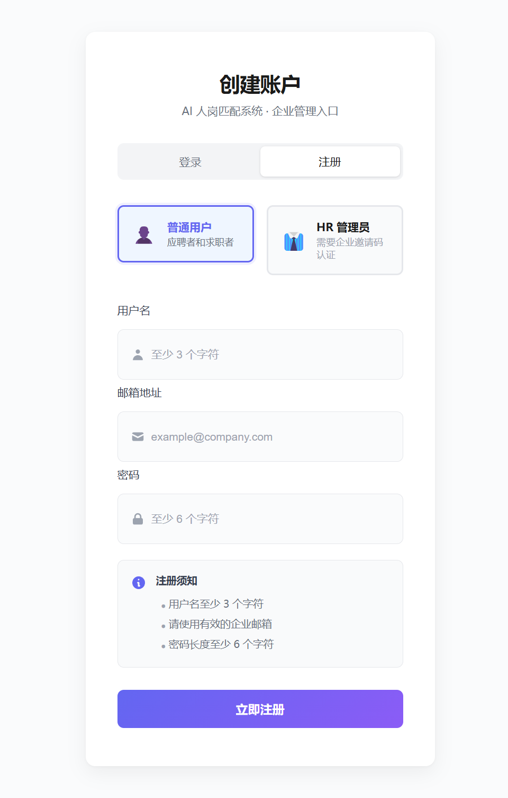
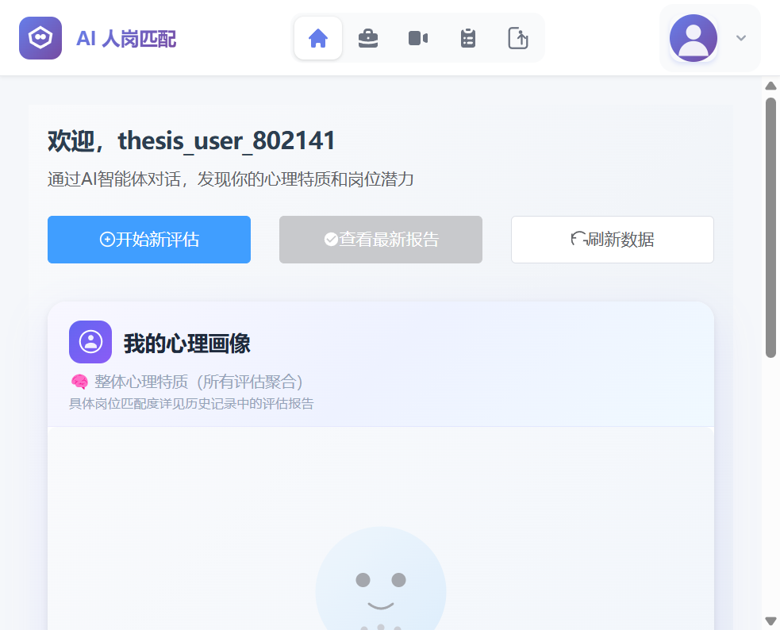
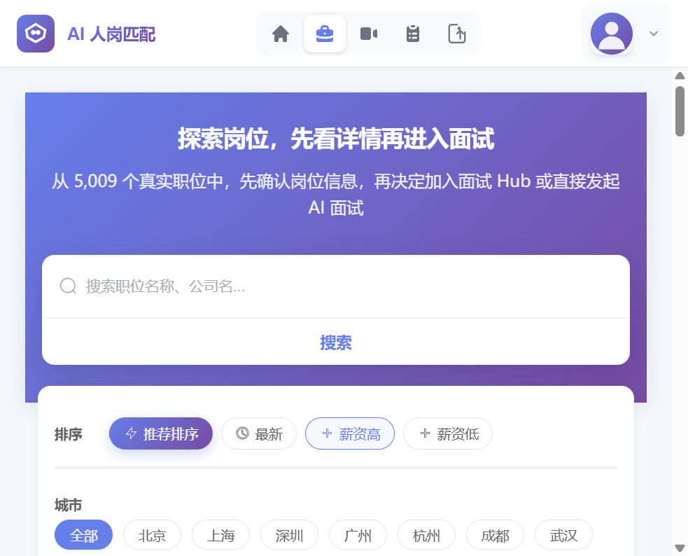
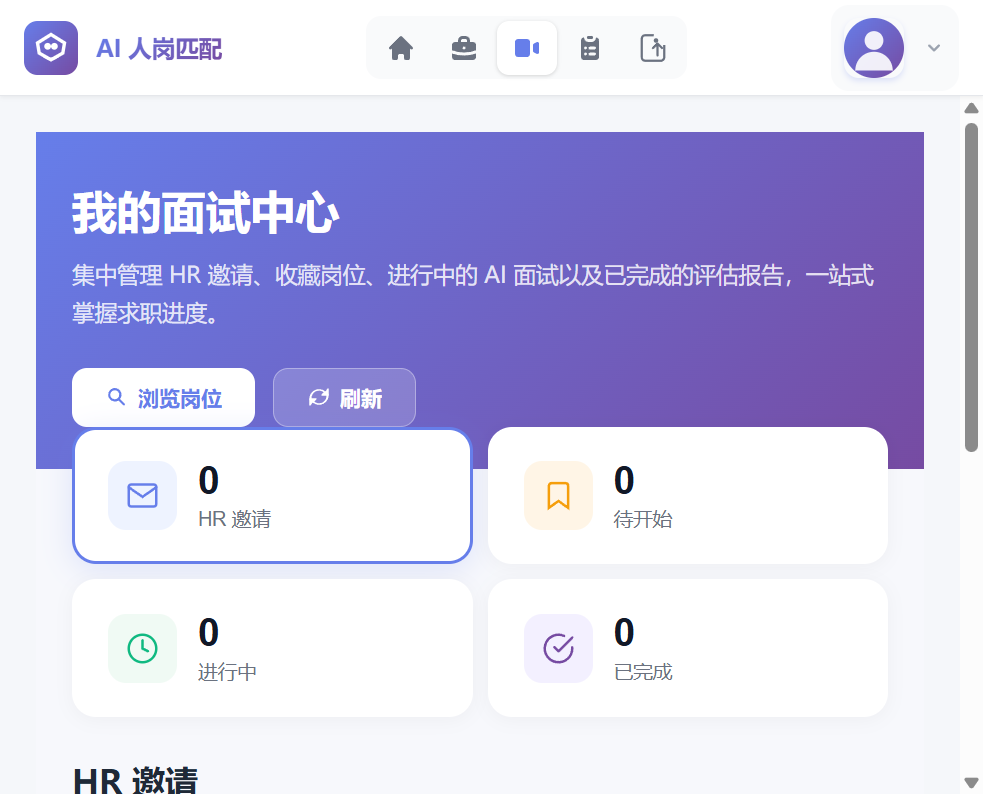
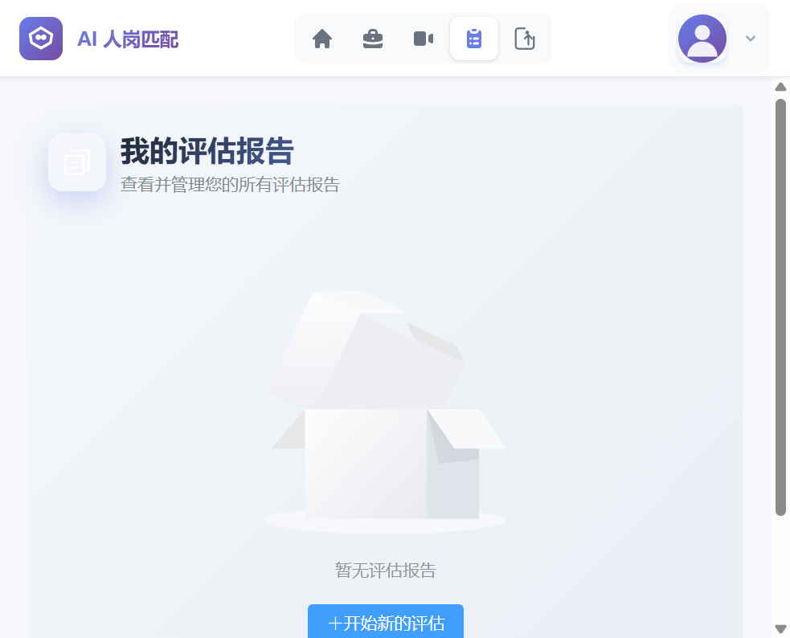
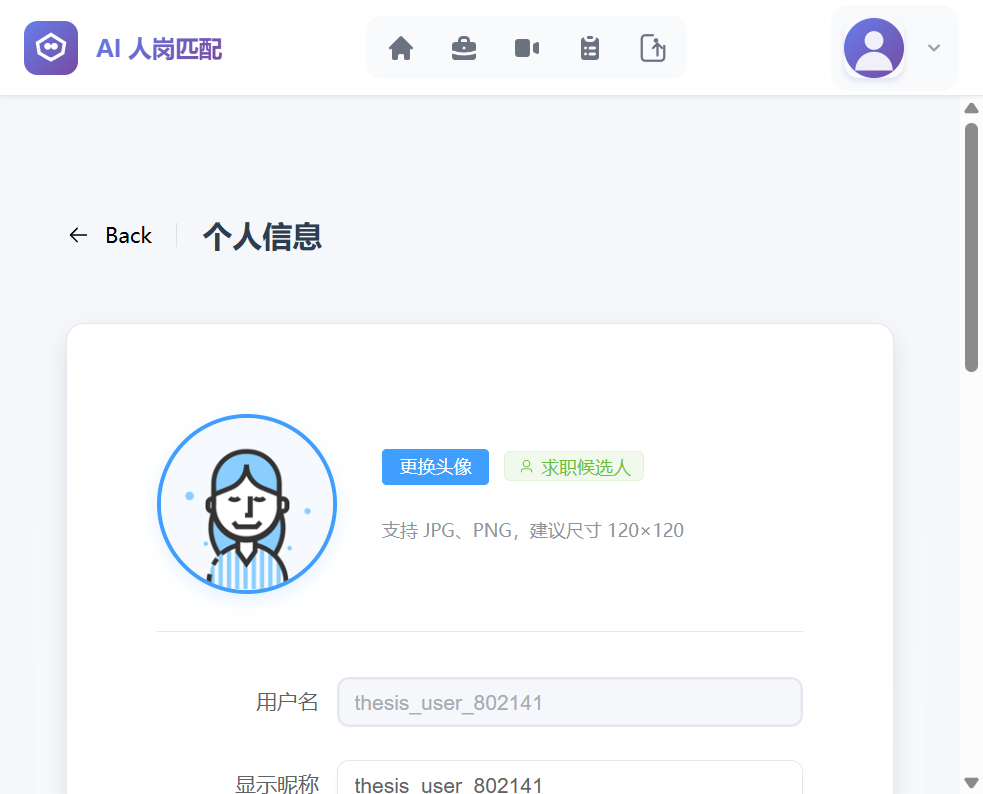
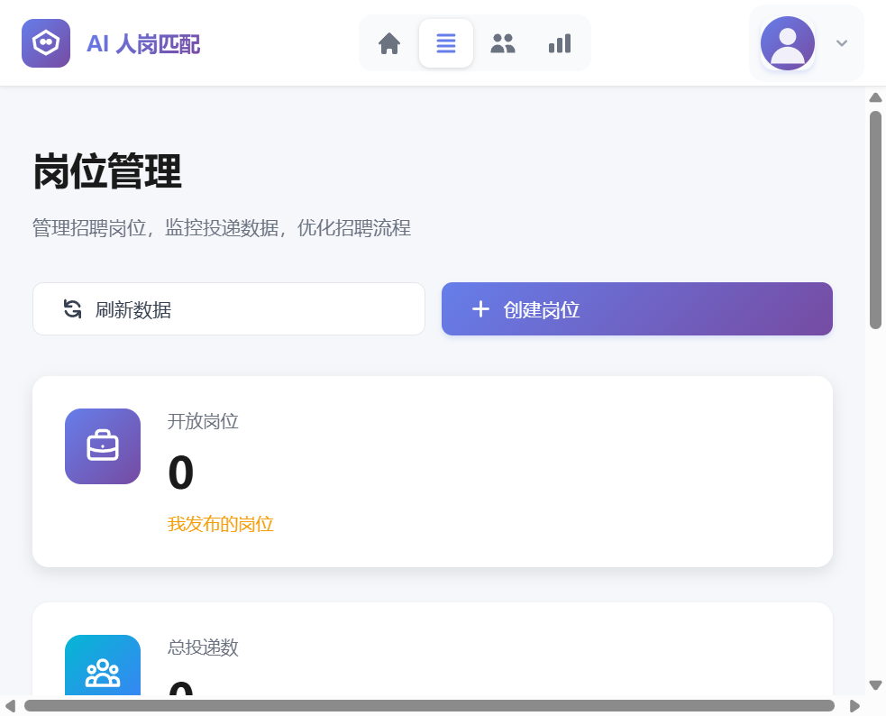
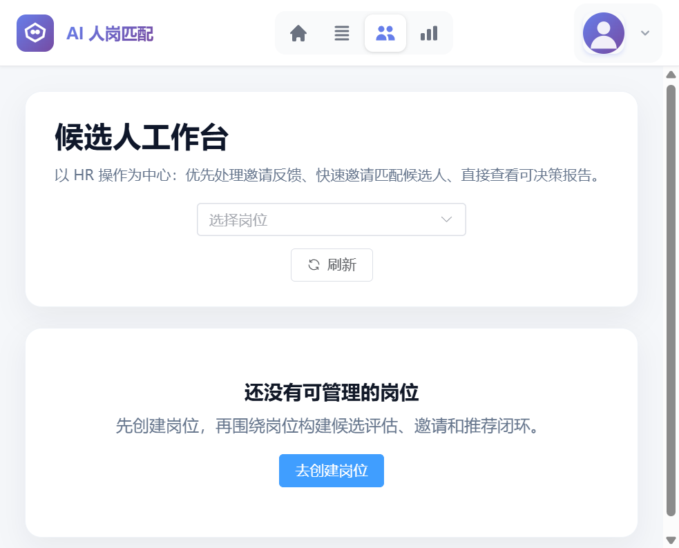
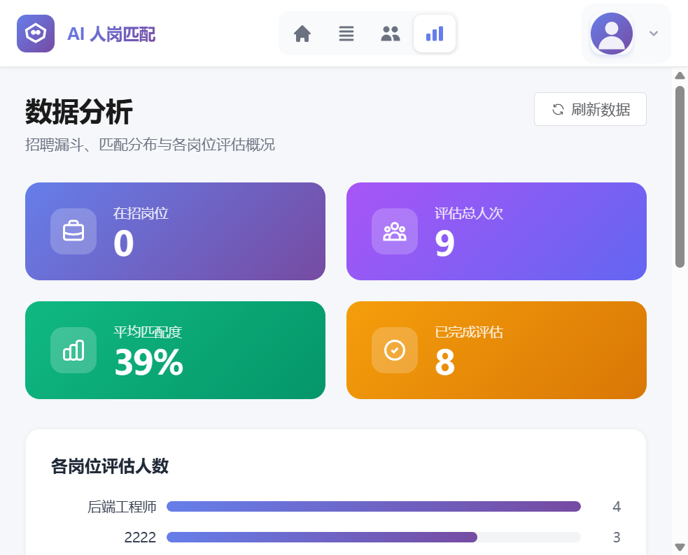

第五章 系统实现

本章介绍系统的实现细节，重点阐述技术选型、核心数据实体映射、关键模块的实现策略。与第三章的架构设计不同，本章描述"实际如何实现"，包括设计中做出的取舍与工程化考量。

---

## 5.1 技术选型与设计决策

### 5.1.1 技术栈选择

**前端**：Vue 3 + TypeScript + Element Plus
- **选择理由**：
  - Vue 3的组合式API提供更灵活的组件逻辑组织
  - TypeScript提供类型安全，减少运行时错误
  - Element Plus提供企业级UI组件库，加快开发周期
- **关键组件**：
  - `MultiAgentInterview.vue`：管理多轮对话的状态机
  - `PersonalityRadar.vue`：可视化Big Five人格评分
  - `MatchingAnalysis.vue`：展示人岗匹配的多维度分析

**后端**：FastAPI + Python
- **选择理由**：
  - FastAPI的自动API文档生成（基于OpenAPI）便于前后端协作
  - 异步I/O特性支持高并发
  - Python生态中NLP和LLM调用库丰富
- **关键服务**：
  - `personality_scoring.py`：实现Big Five评分算法
  - `interview.py`路由：协调多Agent的对话流程
  - `llm_client.py`：统一的LLM调用接口

**数据库**：MySQL 8.0 + SQLAlchemy ORM
- **选择理由**：
  - MySQL的事务支持和ACID特性保证数据一致性
  - SQLAlchemy提供ORM层，便于数据模型定义和查询
  - 成熟的部署、备份生态
- **核心表**：在第三章基础上，实现时进行了以下调整（见5.2）

**LLM集成**：OpenAI API（GPT-3.5/GPT-4）
- **功能**：
  - 问题生成：基于岗位需求和当前状态，自动生成自适应问题
  - 特征提取：从候选人回答中识别人格线索、技能表现
  - 解释文本生成：生成人岗匹配分析和个性化建议

### 5.1.2 核心设计决策

**决策1：后端集中人格计算**

在设计阶段考虑过前端+后端混合计算，最终选择"后端集中"，原因：
- 📌 **一致性**：所有候选人的人格评分采用同一个算法版本，避免前端浏览器版本差异
- 📌 **可追踪**：评分计算的每一步都有日志记录在后端，便于审计
- 📌 **灵活升级**：算法更新无需前端发版，后端直接修改
- 📌 **安全性**：敏感的评分逻辑不暴露到客户端

实现位置：`backend/utils/personality_scoring.py`

**决策2：会话隔离机制**

每个"候选人 + 岗位"的评估过程对应一个`AssessmentRecord`（数据库中的对应实体），所有该会话的对话、评分、结果都关联到这个会话ID，实现完全隔离。

具体实现：
```python
# 创建评估会话
assessment = AssessmentRecord(
    candidate_id=candidate_id,
    job_id=job_id,
    status="ongoing"
)
session.add(assessment)
session.commit()

# 所有后续操作都通过assessment_id关联
dialogue = ConversationTurn(
    assessment_id=assessment.id,
    agent_type="technical",
    message=response_text
)
```

优势：
- ✓ 同一候选人的多个评估（不同岗位）不会相互影响
- ✓ 数据查询高效（通过assessment_id快速定位）
- ✓ 便于导出和归档

**决策3：多Agent融合权重设定**

在系统中，三个Agent的评分通过加权融合：
$$\text{综合人格评分} = w_{\text{tech}} \times s_{\text{tech}} + w_{\text{hr}} \times s_{\text{hr}} + w_{\text{manager}} \times s_{\text{manager}}$$

实际实现中，权重设定为**均等**（各为1/3），考虑：
- 📌 在初始版本中，三个角色的重要性难以提前确定
- 📌 均等权重保留了后续通过A/B测试调整的灵活性
- 📌 对用户而言更容易理解和解释

权重配置在`config.py`中，支持参数化调整。

---

## 5.2 核心数据实体与模型映射

### 5.2.1 数据模型与论文设计的对应

第三章的架构设计提出了七个核心实体。在实现阶段，根据具体的工程需求进行了以下映射与调整：

| 论文设计的实体 | 实现中的数据模型 | 说明 |
|-----------|------------|------|
| `User` | `User` (models/user.py) | 完全对应 |
| `Role`（岗位模板） | `Role` (models/job.py) | 完全对应 |
| `Job`（岗位实例） | `Job` (models/job.py) | 完全对应 |
| `AssessmentSession` | `AssessmentRecord` (models/assessment.py) | **命名调整**：更符合实际含义（记录一次评估）|
| `DialogueHistory` | `ConversationTurn` (models/conversation.py) | **结构调整**：增加emotion, sentiment等字段用于情感分析 |
| `TraitScores` | `TraitScore` (models/trait.py) | **简化**：仅存储Big Five的五个维度评分 |
| `EvaluationResult` | `AssessmentMatchAnalysis` (models/assessment.py) | **分解**：结果分散在多个表中 |

### 5.2.2 关键字段说明

**AssessmentRecord 表** (核心会话表)

```python
class AssessmentRecord(Base):
    __tablename__ = "assessment_records"
    
    id: UUID                          # 会话唯一标识
    candidate_id: str                 # 候选人ID
    job_id: str                       # 岗位ID
    status: AssessmentStatus          # 状态 (ongoing/completed/abandoned)
    
    # 多维评分
    technical_score: float            # 技术维度评分
    hr_score: float                   # HR维度评分
    manager_score: float              # 主管维度评分
    match_score: float                # 综合人岗匹配度 (0-100)
    
    # 基础人格评分（Big Five）
    personality_extroversion: float   # 外向性 (0-100)
    personality_agreeableness: float  # 宜人性 (0-100)
    personality_conscientiousness: float  # 尽责性 (0-100)
    personality_openness: float       # 开放性 (0-100)
    personality_neuroticism: float    # 神经质 (0-100)
    
    # 时间戳
    created_at: DateTime
    completed_at: Optional[DateTime]
```

**ConversationTurn 表** (对话历史)

```python
class ConversationTurn(Base):
    __tablename__ = "conversation_turns"
    
    id: UUID
    assessment_id: UUID               # 外键：关联会话
    round_num: int                    # 轮次（1, 2, 3...）
    turn_num: int                     # 该轮内的序号
    speaker: Speaker                  # 说话者 (CANDIDATE/INTERVIEWER/SYSTEM)
    message: Text                     # 对话内容
    
    # 情感分析
    emotion: str                      # 检测到的情绪 (positive/neutral/negative)
    sentiment_score: float            # 情感得分 (-1~1)
    confidence_score: float           # 模型的置信度
    response_time_ms: int             # 候选人的响应时间（毫秒）
    
    timestamp: DateTime
```

### 5.2.3 设计调整说明

**调整1：TraitScores的简化**

原设计中，`TraitScores`表包含`basic_traits`（基础人格）和`scenario_traits`（场景人格）两个JSON字段，用以实现"分层人格"。

实现时，**仅实现了基础人格**（Big Five），原因：
- 📌 **工程复杂性**：场景人格需要针对每个岗位的环境特征进行推断，需要额外的特征工程
- 📌 **数据量**：同一候选人对不同岗位的场景人格可能不同，存储量增加
- 📌 **验证难度**：在有限的实验数据下，难以验证场景人格推断的有效性

**补充方案**：通过增加`emotion`, `sentiment`等字段，在对话层面捕捉"情境下的情感波动"，间接反映在不同岗位场景下的人格表现。

**调整2：EvaluationResult的分解**

原设计中，`EvaluationResult`是一个大表，包含所有的匹配分析和建议。

实现时，将结果分散存储：
- `AssessmentRecord`：存储各维度评分和综合匹配度
- `AssessmentMatchAnalysis`：存储详细的匹配分析（优势、改进空间）
- `PersonalityTraitDescription`：存储人格描述
- `CandidatePersonalityProfile`：存储聚合的人格画像

**原因**：
- 📌 **查询灵活性**：评分和分析分离，查询时可独立获取
- 📌 **可维护性**：数据更新时，只需更新相关的表，避免大表的锁竞争

---

## 5.3 关键模块的实现

### 5.3.1 后端人格计算服务

**位置**：`backend/utils/personality_scoring.py`

**核心函数**：`score_big_five_from_abilities()`

```python
def score_big_five_from_abilities(
    abilities: Dict[str, float],
    context: InterviewContext
) -> Dict[str, float]:
    """
    根据面试中识别的能力维度，推断Big Five人格评分。
    
    映射规则：
    - 表达能力 → 外向性 (0.7倍权重)
    - 协作能力 → 宜人性 (0.8倍权重)
    - 执行能力 → 尽责性 (0.9倍权重)
    - 创新思维 → 开放性 (0.8倍权重)
    - 压力应对 → 神经质 (反向，0.7倍权重)
    """
    # 实现细节在后端代码中
    pass
```

**设计特点**：
- 📌 **映射制度**：将可观察的能力（面试中可直接看到）映射到心理学维度（Big Five）
- 📌 **多源融合**：三个Agent独立进行映射，然后融合
- 📌 **版本管理**：评分算法带版本号（如`SCORING_MODEL_VERSION = "bigfive_map_v1_2026_04"`），便于追踪

**局限**：
- 仅基于"能力"推断人格，而非通过大五问卷或行为学观察
- 映射权重是启发式的，基于领域知识而非大规模验证

### 5.3.2 多Agent协同面试引擎

**位置**：`backend/routers/interview.py` + `backend/services/interview_service.py`

**流程**：

1. **初始化会话**
   ```
   POST /assessment/{assessment_id}/start
   → 创建 AssessmentRecord
   → 初始化 Agent 上下文
   ```

2. **循环问答**
   ```
   for each agent in [technical, hr, manager]:
       GET /assessment/{assessment_id}/question?agent={agent}
       → LLM 生成自适应问题
       
       POST /assessment/{assessment_id}/answer
       → 记录对话
       → LLM 分析能力特征
       → 计算 Agent 评分
   ```

3. **评估完成**
   ```
   POST /assessment/{assessment_id}/complete
   → 融合三个 Agent 评分
   → 计算人岗匹配度
   → 生成报告
   ```

**关键特性**：
- ✓ **自适应问题生成**：根据前面的回答调整难度和方向
- ✓ **实时评分**：每答一个问题就进行评分，而非等最后统计
- ✓ **会话保留**：完整的对话历史保存，支持事后分析

### 5.3.3 人岗匹配计算

**位置**：`backend/services/matching_service.py`

**匹配度计算**：

```python
def calculate_match_score(
    candidate_traits: Dict[str, float],  # Big Five评分
    candidate_abilities: Dict[str, float],  # 能力评分
    job_requirements: Dict[str, float],  # 岗位需求
    candidate_expectations: Dict[str, float]  # 候选人期待
) -> float:
    """
    计算三维匹配度的综合评分。
    """
    ability_match = similarity(candidate_abilities, job_requirements.abilities)
    personality_match = similarity(candidate_traits, job_requirements.personality)
    expectation_match = similarity(candidate_expectations, job_requirements.expectations)
    
    # 加权融合
    total_score = (
        0.4 * ability_match +
        0.35 * personality_match +
        0.25 * expectation_match
    )
    
    return total_score  # 0-100
```

**权重设定说明**：
- 📌 **能力优先**（0.4）：技术能力是最基础的筛选条件
- 📌 **人格次要**（0.35）：长期工作满意度和绩效与人格相关
- 📌 **期待适中**（0.25）：职业期待虽重要，但可通过沟通调整

### 5.3.4 报告生成与可解释性

**位置**：`backend/services/report_agent.py`

**生成流程**：

```python
def generate_comprehensive_report(assessment_id: UUID) -> Report:
    """
    生成四层解释的评估报告。
    """
    
    # 第1层：决策链路追踪
    decision_chain = trace_decision_path(assessment_id)
    
    # 第2层：维度级解释
    dimension_explanations = {
        "extroversion": explain_dimension("extroversion", assessment_id),
        "agreeableness": explain_dimension("agreeableness", assessment_id),
        # ...
    }
    
    # 第3层：证据引用
    evidence_snippets = extract_supporting_quotes(assessment_id)
    
    # 第4层：综合建议
    recommendations = generate_recommendations(assessment_id)
    
    return Report(
        chain=decision_chain,
        dimensions=dimension_explanations,
        evidence=evidence_snippets,
        recommendations=recommendations
    )
```

**关键特点**：
- ✓ **可追踪**：从原始对话、能力特征、人格推断、岗位需求，逐步到最终建议
- ✓ **证据引用**：直接摘录候选人的原始对话，支持可验证性
- ✓ **模板生成**：基于LLM生成自然语言的解释和建议

**局限**：
- 目前的实现是"模板填充"式的，不是完全的理由链式推导
- 缺乏反事实解释（如"如果X改变，结果会如何"）

---

## 5.4 前端页面实现与截图说明

本节基于系统运行态页面进行说明。页面截图来源于本地开发环境（前端：Vite，后端：FastAPI），用于展示第五章"实现落地"的前端证据链。

### 5.4.1 候选人端页面

**页面A：登录页（Login）**
- 路由：`/login`
- 主要功能：账号登录、登录/注册模式切换、基础身份入口。
- 实现要点：登录成功后将token与用户信息写入本地存储，并触发路由守卫进入业务页。

图5-1 登录页实现截图：


**页面B：注册页（Register）**
- 路由：`/login`（注册Tab）
- 主要功能：候选人/HR身份选择、用户名邮箱密码校验、注册提交。
- 实现要点：注册流程在同一登录页中以Tab模式实现，降低入口复杂度。

图5-2 注册页实现截图：


**页面C：候选人首页（Home）**
- 路由：`/home`
- 主要功能：评估入口、最新报告快捷入口、心理画像概览。
- 实现要点：首页聚合候选人关键操作，作为"开始评估 -> 查看结果"的任务中枢。

图5-3 候选人首页实现截图：


**页面D：岗位浏览页（Job List）**
- 路由：`/home/jobs`
- 主要功能：岗位列表检索、岗位基础信息浏览、进入岗位详情。
- 实现要点：岗位浏览与后续评估入口联动，形成候选人投递前决策链。

图5-4 岗位浏览页实现截图：


**页面E：我的面试页（Interview Hub）**
- 路由：`/home/interviews`
- 主要功能：查看进行中/历史评估记录、进入面试房间、继续作答。
- 实现要点：与会话隔离机制（assessment_id）对齐，确保候选人仅访问自己的评估会话。

图5-5 我的面试页实现截图：


**页面F：报告列表页（Report List）**
- 路由：`/home/reports`
- 主要功能：历史报告查看、报告详情跳转、结果追踪。
- 实现要点：报告列表与评估记录关联，支持候选人纵向比较不同会话结果。

图5-6 报告列表页实现截图：


**页面G：个人信息页（Profile）**
- 路由：`/home/profile`
- 主要功能：个人资料维护、展示昵称/实名策略、联系方式管理。
- 实现要点：为后续投递与报告展示提供稳定的候选人画像基础信息。

图5-7 个人信息页实现截图：


### 5.4.2 HR端页面

**页面H：岗位管理页（Job Manage）**
- 路由：`/home/job-manage`
- 权限：`requiresHR = true`
- 主要功能：岗位创建、岗位维护、招聘岗位运营管理。
- 实现要点：通过路由守卫限制仅HR用户可访问。

图5-8 HR岗位管理页实现截图：


**页面I：候选人管理页（Candidate Manage）**
- 路由：`/home/candidates`
- 权限：`requiresHR = true`
- 主要功能：候选人列表管理、评估进度查看、候选人筛选。
- 实现要点：将候选人评估状态与岗位流程关联，支持HR操作闭环。

图5-9 HR候选人管理页实现截图：


**页面J：数据分析页（Analytics）**
- 路由：`/home/analytics`
- 权限：`requiresHR = true`
- 主要功能：招聘漏斗、匹配分布、岗位评估统计。
- 实现要点：面向HR提供汇总视图，支持决策层面的招聘质量复盘。

图5-10 HR数据分析页实现截图：


### 5.4.3 页面实现与架构一致性说明

前端页面实现与第三章架构的对应关系如下：

1. 用户侧页面（登录、注册、岗位浏览、面试、报告、个人信息）对应"候选人评估流程"主线。
2. HR侧页面（岗位管理、候选人管理、数据分析）对应"招聘运营流程"主线。
3. 路由守卫通过`requiresAuth`与`requiresHR`两层策略实现访问控制，与RBAC设计一致。
4. 页面层仅负责交互与展示，核心计算（人格评分、匹配计算、报告生成）均在后端完成，符合"后端集中计算"原则。

---

## 5.5 工程化考量

### 5.4.1 性能优化

**查询优化**：
- 使用索引加速常见查询（如按assessment_id查询对话）
- 缓存热点数据（岗位模板、Big Five映射规则）

**并发处理**：
- FastAPI的异步I/O处理多个评估会话并发
- 数据库连接池管理（SQLAlchemy的session工厂）

**测试覆盖**：
- 单元测试覆盖关键业务逻辑（personality_scoring, match_score等）
- 集成测试覆盖端到端流程

### 5.4.2 数据一致性保证

**事务管理**：
```python
# 确保评估完成的原子性
with database.transaction():
    assessment.status = "completed"
    assessment.completed_at = datetime.now()
    # 如果任何操作失败，整个事务回滚
    db.commit()
```

**会话隔离**：
- 通过assessment_id确保数据完全隔离
- 权限检查确保只有相关用户能访问该会话的数据

### 5.4.3 系统扩展性

**模块化设计**：
- 各个service（personality, matching, report）相对独立
- 便于后续替换算法或新增功能

**参数化配置**：
- 权重、阈值、LLM参数等都在`config.py`中定义
- 支持快速调整而无需改动代码

---

## 5.6 实现与设计的偏差

### 5.6.1 有意的设计调整

本节说明实现时相对论文设计的主要调整：

**调整1：场景人格（Scenario Traits）**
- 论文设计：基础人格 + 场景人格（两层）
- 实现：仅基础人格
- 原因：工程复杂性与数据验证的权衡
- 补救方案：通过情感、情绪等间接指标捕捉情境效应

**调整2：数据模型命名**
- 论文：AssessmentSession, DialogueHistory, TraitScores, EvaluationResult
- 实现：AssessmentRecord, ConversationTurn, TraitScore, AssessmentMatchAnalysis等
- 原因：更贴切的工程术语与实际的数据结构
- 影响：文献对应关系需加脚注说明

**调整3：可解释性的完整性**
- 论文设计：完整的决策链路追踪与反事实解释
- 实现：模板化的解释文本，缺少严格的推理链
- 原因：LLM生成的灵活性与自动化的权衡
- 改进方向：未来可添加显式的推理规则引擎

### 5.6.2 满足设计要求的部分

以下设计要求在实现中得到了完整体现：

- ✅ **会话隔离**：通过assessment_id完全隔离数据
- ✅ **后端集中计算**：人格评分、匹配度计算都在后端进行
- ✅ **多Agent协同**：三个Agent独立评估，融合权重(1/3各占)
- ✅ **岗位双层建模**：Role模板 + Job实例的设计完整实现
- ✅ **权限管理**：RBAC模型实现，候选人只见自己的报告，HR见招聘信息

---

## 5.7 本章小结

本章说明了系统从"架构设计"到"工程实现"的过程中的决策与取舍：

1. **技术选型合理**：Vue 3 + FastAPI + MySQL的组合适合快速迭代与演进
2. **核心创新部分保留**：会话隔离、后端集中计算、多Agent融合等设计在实现中得到体现
3. **工程与学术的平衡**：在保证学术严谨性的同时，做出了实用主义的取舍（如场景人格的简化）
4. **扩展性设计**：通过模块化和参数化，支持后续的优化和新功能添加

这个实现为第六章的实验验证提供了基础。
